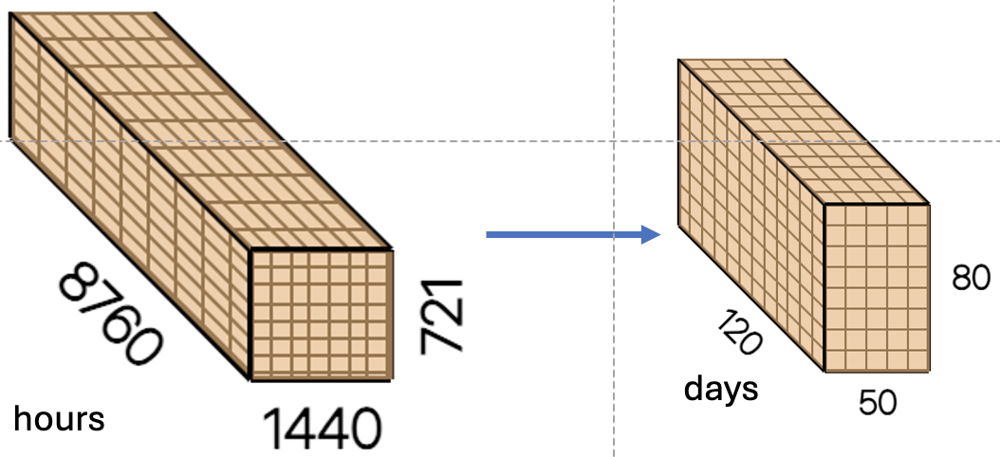
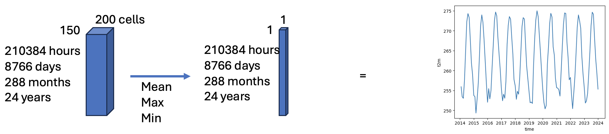
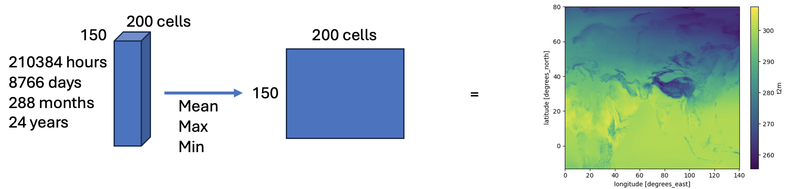

# iharp-queries

To init venv
```
bash init_venv.sh 
```

---

| Query              |       Status       |
| ------------------ | :----------------: |
| get raster         | :white_check_mark: |
| get time series    | :white_check_mark: |
| get heatmap (mean) | :white_check_mark: |
| get heatmap (min)  | under code review  |
| get heatmap (max)  | under code review  |
| get heatmap (sum)  |        todo        |
| find time          |      baseline      |
| find area          |      baseline      |

---

| Query           | Input                                                                                                                                                                                     |             Example              |
| --------------- | :---------------------------------------------------------------------------------------------------------------------------------------------------------------------------------------- | :------------------------------: |
| get raster      | variable</br>start_datetime</br>end_datetime</br>time_resolution(hour, day, month, year)</br>time_aggregation_method(mean, min, max, sum)</br>min_lat</br>max_lat</br>min_lon</br>max_lon |       |
| get time series | everything in **[get raster]**</br>time_series_aggregation_method(mean, min, max, sum)                                                                                                    |  |
| get heatmap     | variable</br>start_datetime</br>end_datetime</br>min_lat</br>max_lat</br>min_lon</br>max_lon</br>heatmap_aggregation_method(mean, min, max, sum)                                          |      |
| find time       | everything in **[get time series]**</br>filter_predicate(>, <, ==, !=, >=, <=)</br>filter_value                                                                                           |                                  |
| find area       | everything in **[get heatmap]**</br>filter_predicate(>, <, ==, !=, >=, <=)</br>filter_value                                                                                               |        |
